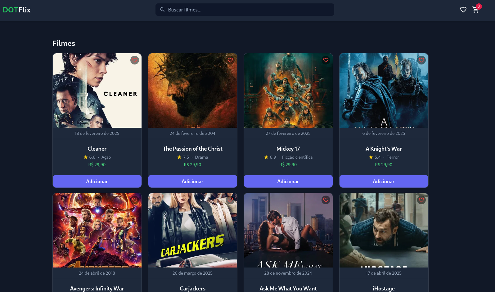

# DOTFlix - Prova Técnica Front-end (Nuxt 3)

Bem-vindo à loja virtual de filmes **DOTFlix**! Este projeto foi desenvolvido como parte de uma prova técnica, com foco em performance, boas práticas, e excelente experiência de usuário (UX).

---

## 🌐 Tecnologias Utilizadas

- [Nuxt 3](https://nuxt.com/) (Vue 3)
- [TailwindCSS](https://tailwindcss.com/)
- [Pinia](https://pinia.vuejs.org/) (gerenciamento de estado)
- [TMDb API](https://www.themoviedb.org/documentation/api) (integração de filmes)
- [Vite](https://vitejs.dev/) (build otimizado)

---

## 🚀 Funcionalidades Implementadas

### Requisitos obrigatórios:

- [x] Tela inicial com lista de filmes populares
- [x] Tela de carrinho lateral funcional
- [x] Tela de checkout com formulário de validação
- [x] Gerenciamento de estado usando Pinia
- [x] Integração com TMDb API via Server API (token seguro)
- [x] Modal de sucesso após compra finalizada

### Requisitos desejáveis:

- [x] Busca de filmes por nome
- [x] Sistema de favoritos lateral
- [x] Máscaras de CPF, telefone, e CEP no checkout

### Melhorias adicionais:

- [x] SEO dinâmico (title, description, OG)
- [x] Scroll infinito com feedback de loading (skeletons)
- [x] Header fixa com efeito backdrop-blur
- [x] Imagens Open Graph e favicon customizados
- [x] Segurança de Token API (via Server Middleware)

---

## 🔧 Instalação do projeto

Clone o repositório:

```bash
https://github.com/brunocarsten/dotflix
```

Instale as dependências:

```bash
npm install
```

Crie um arquivo `.env` na raiz com o token de acesso da TMDb:

```env
ACCESS_TOKEN=seu_token_aqui
```

Rode o servidor de desenvolvimento:

```bash
npm run dev
```

Acesse em: [http://localhost:3000](http://localhost:3000)

---

## 🎓 Considerações

- O projeto foca na melhor prática de separação entre **Client** e **Server**.
- Todas as chamadas para a API externa (TMDb) passam primeiro pelo servidor Nuxt para proteger o token.
- A interface foi criada responsiva, com ênfase na experiência mobile.
- Código modular, utilizando Components e Composables onde apropriado.

---

## 🏆 Screenshots

**Home - Listagem de Filmes**




---

## 👤 Desenvolvido por

- **Seu Nome Aqui**
- [LinkedIn](https://www.linkedin.com/in/bruno-carsten-de-ara%C3%BAjo-244a5a104/)
- [GitHub](https://github.com/brunocarsten)


---

# DOT Digital Group 📲

